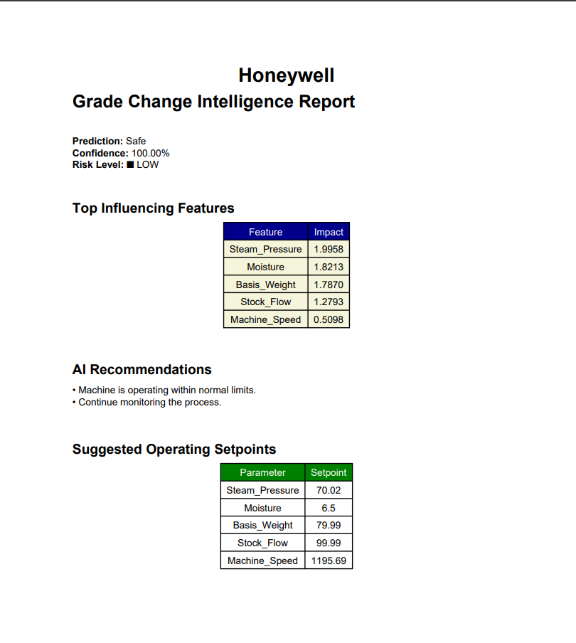

# 📄 Honeywell Grade Change Intelligence

> AI-Powered Decision Support System for Predicting Paper Grade Change Risks using Explainable AI (XGBoost + SHAP)


---

## 📌 Overview

Honeywell Grade Change Intelligence is an AI-powered industrial decision support system designed to predict paper grade change risks before they occur.

The system analyzes production parameters using an XGBoost model, explains predictions with SHAP (Explainable AI), generates intelligent recommendations, suggests optimal operating setpoints, visualizes process insights, and exports professional PDF reports.

---

## ✨ Features

- 🤖 AI-based Grade Change Prediction
- 📊 Explainable AI using SHAP
- 📈 Confidence Score Analysis
- 💡 AI Recommendations
- ⚙️ Suggested Operating Setpoints
- 🔥 Correlation Heatmap
- 📄 PDF Report Generation
- 📋 Operator Feedback
- 📱 Interactive Streamlit Dashboard

---

## 🏗️ Project Architecture

(Add Architecture Diagram Here)

```
Production Data
      │
      ▼
Data Preprocessing
      │
      ▼
XGBoost Prediction
      │
      ▼
SHAP Explainability
      │
      ▼
Decision Support
      │
      ▼
Dashboard + PDF Report
```

---

## 🛠️ Tech Stack

| Category | Technology |
|----------|------------|
| Programming | Python |
| Machine Learning | XGBoost |
| Explainable AI | SHAP |
| Dashboard | Streamlit |
| Data Processing | Pandas, NumPy |
| Visualization | Matplotlib |
| Report Generation | ReportLab |
| Model Storage | Joblib |
| Version Control | Git & GitHub |

---

## 📂 Project Structure

```text
Honeywell-Grade-Change-Intelligence/
│
├── dashboard/
├── src/
├── models/
├── data/
├── requirements.txt
└── README.md
```

---

## 📷 Screenshots

### 🏠 Dashboard

images/dashboard.png

### 📊 AI Prediction

images/prediction.png
### 📈 SHAP Explanation

(Add Screenshot)

```

```

---

### 💡 AI Recommendations

images/recommendation.png

### 🔥 Correlation Heatmap

images/heatmap.png

### 📄 PDF Report

(Add Screenshot)

```

```

---

## 🚀 Installation

```bash
git clone https://github.com/YOUR_USERNAME/HoneywellGradeChangeIntligence.git

cd HoneywellGradeChangeIntligence

pip install -r requirements.txt

streamlit run dashboard/app.py
```

---

## 📈 Workflow

1. Enter production parameters.
2. AI predicts grade-change risk.
3. SHAP explains the prediction.
4. AI generates recommendations.
5. Dashboard displays insights.
6. Export PDF report.

---

## 🎯 Future Enhancements

- Live IoT Sensor Integration
- Real-time Monitoring
- Cloud Deployment
- Multi-line Manufacturing Support
- Predictive Maintenance
- ERP Integration

---

## 📚 References

- XGBoost
- SHAP
- Scikit-learn
- Streamlit
- Pandas
- ReportLab

---

## 👨‍💻 Author

**Atharv Patil**

Computer Engineering Student

Cloud Computing & Automation

VIT Bhopal University

GitHub: https://github.com/AtharvCodeCraft

---

⭐ If you found this project useful, don't forget to star the repository!